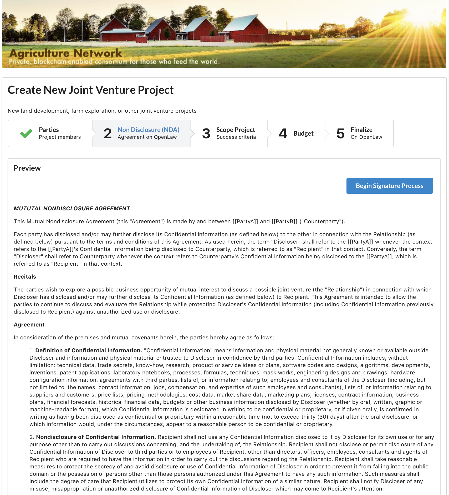
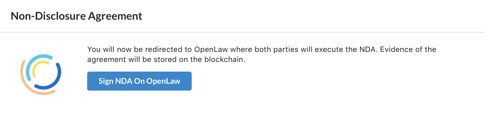

# OpenLaw / Kaleido API Integration Demonstration

This project demonstrates how one might integrate a private blockchain consortium based on [Kaleido](https://kaleido.io) and [OpenLaw](https://openlaw.io).  Combining the OpenLaw API with Kaleido private blockchain networks makes it possible to build powerful, legally enforceable agreements among consortium participants.

## About the Demo Consortium

This demonstration envisions a fictitious consortium of agricultural organizations--possibly suppliers, farmers, land owners, regulators, and others.

Any number of possible interactions are possible on the network.  Participants could buy and sell produce.  They could trace the provenance of supplies.  They may track the movement of inventory using internet of things ("IoT") devices and store evidence on the private blockchain.  Anything is possible.

In this demonstration, we demonstrate how two participants in the consortium could enter into a joint venture ("JV") project where evidence and performance of the project could be stored on the private, Kaleido-based blockchain network.


The first screen, pictured above, is the first of a few steps for joint venture participants to set up a new project among themselves.



After entering the data, the participants will get a preview screen, depicted above, of the non-disclosure agreement.  This was the result of an API call from the joint venture distributed application through the OpenLaw API to retrieve the preview.



Once the user is ready to begin the signature process on OpenLaw, they will receive modal notification rendered above.


Finally, after clicking the modal button, users will be redirected to OpenLaw where they can complete the signature process.

For now, that is the end of the demonstration.  The other steps in the process have not been built out, but hopefully we have captured your imagination for how to combine the OpenLaw API with Kaleido private networks to build powerful, legally enforceable agreements among consortium participants.


## Configuration

For now, there are four key variables you will need to hard code in the React application.

Starting at line 6 of `src/App.js`, you will need to define the following variables:

```javascript
const openLawConfig = {
  server: "SERVER_NAME",
  templateName: 'TEMPLATE_NAME',
  userName: 'OPENLAW_USER',
  password: 'OPENLAW_PASSWORD'
}
```

* **SERVER_NAME** is the URL for the OpenLaw server, such as `https://app.openlaw.io`
* **TEMPLATE_NAME** is the full text name of the template, which in our demonstration was "NDA Demo (Kaleido)"
* **OPENLAW_USER** the user account on OpenLaw that you've created to support API calls (e.g., not necessarily the user account of the user who will be signing the agreement)
* **OPENLAW_PASSWORD** the password for that user


### How to Run the Demo

It is easiest to run the application locally with the following command:

```
npm start
```

Open [http://localhost:3000](http://localhost:3000) to view it in the browser.

The demonstration works best under these circumstances:
* you first create two user accounts to mimic the joint venture participants and keep track of their passwords, and
* you log into the OpenLaw website with one of those users for the joint venture.


## For More

* **Kaleido** Visit Kaleido [here](https://kaleido.io)
* **OpenLaw** Visit OpenLaw [here](https://openlaw.io)
* To learn more about documenting legally binding, blockchain-enabled contracts, visit [docs.openlaw.io](https://docs.openlaw.io)
